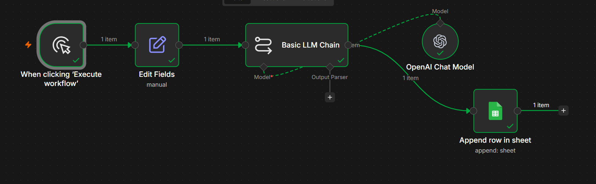
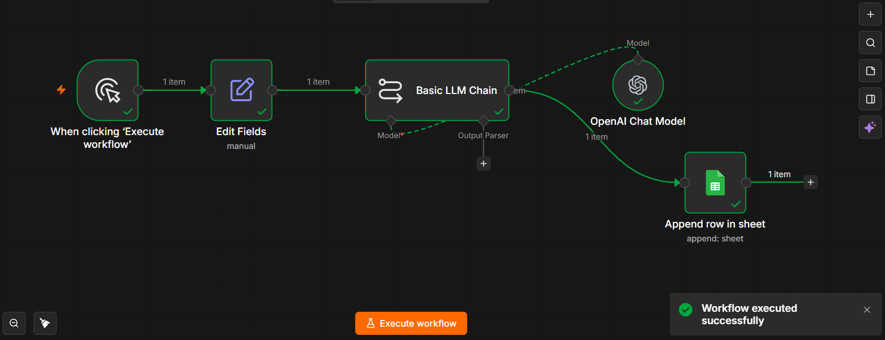

# Automated Lead Qualification Workflow

## Overview

This project demonstrates an automated lead qualification system built using **n8n**, **OpenAI**, and **Google Sheets**.

The workflow analyzes incoming lead information, generates a qualification summary, recommends next actions, and automatically stores the results in a structured database.

---

## Business Problem

Sales teams often spend valuable time manually reviewing and prioritizing incoming leads.

This process can be:

* Time-consuming
* Inconsistent
* Difficult to scale

As lead volume increases, valuable opportunities may be delayed or overlooked.

---

## Solution

This workflow automates the lead qualification process by:

1. Receiving lead information
2. Analyzing the lead using AI
3. Generating a lead summary
4. Recommending next actions
5. Storing the results in Google Sheets

The result is a faster and more consistent qualification process.

---

## Workflow Architecture

```text
Lead Information
      ↓
AI Analysis
      ↓
Lead Qualification
      ↓
Google Sheets Storage
```

---

## Features

* Automated lead analysis
* AI-generated lead summaries
* Lead qualification recommendations
* Automatic spreadsheet storage
* Simple and scalable workflow design

---

## Business Impact

* Faster lead qualification
* Reduced administrative work
* Prioritized high-value opportunities
* Improved sales follow-up
* Consistent lead evaluation process

---

## Tech Stack

* n8n
* OpenAI API
* Google Sheets

---

## Screenshots

### Workflow Overview



### Workflow Execution



### Results Stored in Google Sheets


---

## Demo Video

Loom Demo:

[(Add your Loom link here)](https://www.loom.com/share/e76e07f439e84c4695d7d858df3301be)

---

## Files Included

| File                      | Description           |
| ------------------------- | --------------------- |
| workflow.json             | Exported n8n workflow |
| screenshots/workflow.png  | Workflow overview     |
| screenshots/execution.png | Successful execution  |
| screenshots/results.png   | Google Sheets output  |

---

## Future Improvements

* CRM integration
* Email notifications
* Lead scoring models
* Multi-channel lead intake
* Automated sales follow-up workflows

---

## Author

Akshay Patel

Building AI-powered workflow automations that help businesses reduce repetitive work and improve operational efficiency.
